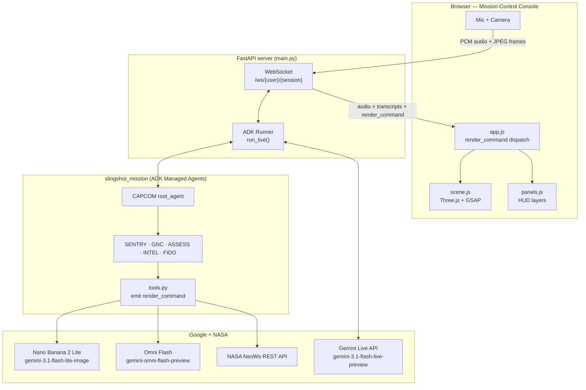
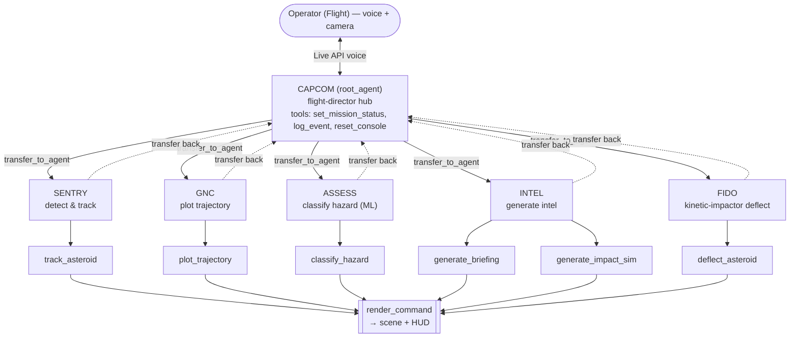
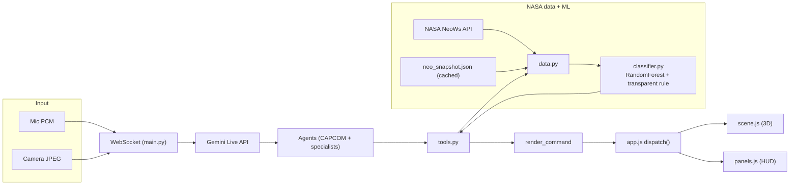
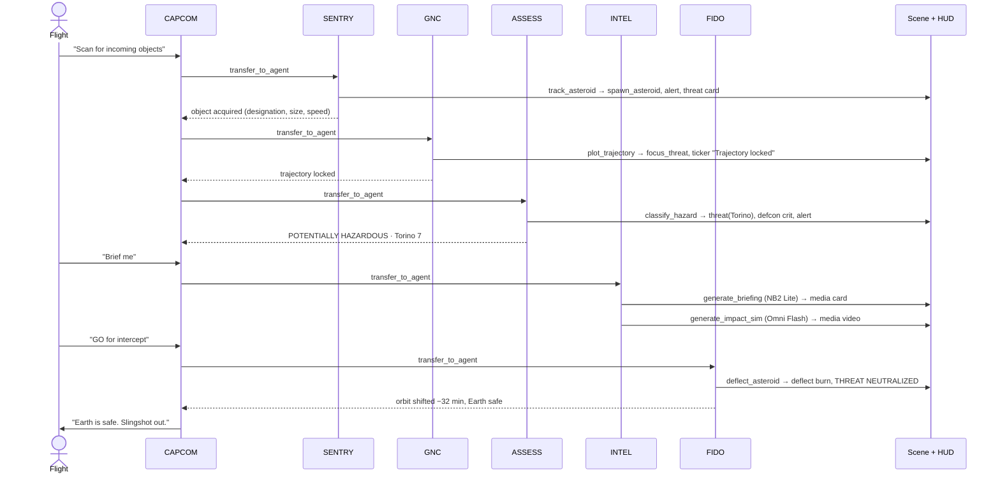
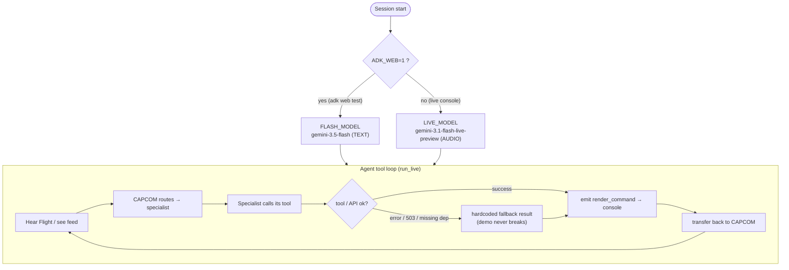
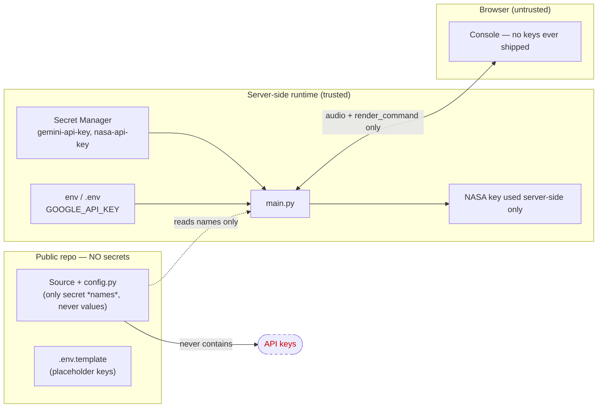

# SLINGSHOT — Design Document

> **Planetary Defense Mission Control.** A real-time, voice-driven, multi-agent NASA app. The operator ("Flight") talks live to **CAPCOM**; a room of agents (CAPCOM → SENTRY, GNC, ASSESS, INTEL, FIDO) detects an incoming near-Earth asteroid, classifies its hazard with an ML model on real NASA NEO data, generates visual intel, and executes a DART-style kinetic-impactor deflection — all rendered in a cinematic Three.js/GSAP orbital scene driven by the agents' tool calls.

This is the living design doc. It is judge-facing: it maps the four qualifying technologies, shows the architecture in Mermaid, and traces every on-stage claim to `RESEARCH.md`.

---

## Status

| Field | Value |
|---|---|
| Project (GCP) | `deepmind-hack26blr-4182` |
| Region | `us-central1` |
| Backend | API-key backend — key loaded from **env / Secret Manager**, never hardcoded |
| Live model | `gemini-3.1-flash-live-preview` (Live API, voice + vision, barge-in) |
| Realtime transport | FastAPI WebSocket ↔ Google ADK `run_live` |
| Frontend | Three.js + GSAP mission-control console (mock + live modes) |
| Repo | https://github.com/preethamtjit20-spec |
| License | MIT |

---

## The four qualifying technologies

Each maps to a concrete file and code path.

| # | Technology | Model ID | Where it lives | What it does in SLINGSHOT |
|---|---|---|---|---|
| 1 | **Gemini Live API** | `gemini-3.1-flash-live-preview` | `app/main.py` → `run_live()` | Real-time voice + vision with barge-in. Streams mic PCM (100 ms chunks) and JPEG camera frames up; streams CAPCOM audio + transcripts down. |
| 2 | **iAPI / Managed Agents** (multi-agent + tool layer) | live model per-agent (`ADK_WEB=1` → `gemini-3.5-flash`) | `app/slingshot_mission/agent.py` (6 agents) + `tools.py` (tool layer) | **The centerpiece.** A CAPCOM hub delegates to 5 specialists; each tool emits `render_command`s that drive the scene + HUD, making the agents' reasoning visible. |
| 3 | **Nano Banana 2 Lite** | `gemini-3.1-flash-lite-image` | `media.generate_briefing_image` (via `generate_briefing`) | Live threat-briefing cards (<4 s image gen). |
| 4 | **Omni Flash** | `gemini-omni-flash-preview` | `media.generate_impact_video` (via `generate_impact_sim`) | Impact / deflection simulation video. |

All model IDs are centralized in `app/config.py` (`MODELS` dict).

---

## Repo layout

```
slingshot/
├── Design.md                         # this document
├── README.md                         # pitch + quickstart
├── LICENSE                           # MIT
├── RESEARCH.md                       # factual backbone — every on-stage number traces here
├── requirements.txt
└── app/
    ├── config.py                     # centralized config: model IDs, project, NASA API, flags
    ├── main.py                       # FastAPI + WebSocket ↔ ADK run_live bridge
    ├── .env.template                 # GOOGLE_API_KEY, feature flags (copy → .env)
    ├── data/
    │   └── neo_snapshot.json         # cached demo NEO (offline reliability net)
    ├── slingshot_mission/
    │   ├── __init__.py               # exports root_agent, log_ai_interaction
    │   ├── agent.py                  # 6-agent mission-control room (CAPCOM + 5 specialists)
    │   ├── tools.py                  # tool layer — emits render_commands
    │   ├── data.py                   # NASA NeoWs / cached-snapshot loader
    │   ├── classifier.py             # ML hazard classifier (RandomForest + transparent rule)
    │   └── media.py                  # NB2 Lite + Omni Flash media generation
    └── static/
        ├── index.html                # mission-control console shell
        └── js/
            ├── app.js                # orchestration; render_command contract + dispatch()
            ├── scene.js              # Three.js/GSAP orbital scene
            └── panels.js            # HUD panels (agents, threat card, log, ticker, defcon)
```

---

## Agents & tools

The multi-agent "mission-control room" is the **iAPI / Managed-Agents** pattern (Google ADK). A root **CAPCOM** dispatcher hears the operator and sees the live feed, then delegates to five specialists via `transfer_to_agent`. Agent `name`s match the frontend roster ids exactly (`panels.js`), so a handoff lights up the right console panel.

| Agent | Role | Tool(s) | `render_command` layers it drives |
|---|---|---|---|
| **CAPCOM** (`root_agent`) | Flight-director hub; hears Flight, runs the room | `set_mission_status`, `log_event`, `reset_console` | `defcon`, `log`, `scene:reset`, `threat` |
| **SENTRY** | Detect & track a NEO | `track_asteroid` | `agent`, `alert`, `scene:spawn_asteroid`, `scene:focus_threat`, `threat`, `defcon`, `log` |
| **GNC** | Plot the approach trajectory | `plot_trajectory` | `agent`, `scene:focus_threat`, `log`, `ticker` |
| **ASSESS** | Classify hazard (ML on NEO data) | `classify_hazard` | `agent`, `threat`, `scene:set_threat`, `defcon`, `log`, `alert` |
| **INTEL** | Generate briefing + impact/deflection sim | `generate_briefing`, `generate_impact_sim` | `agent`, `media`, `log` |
| **FIDO** | Execute kinetic-impactor deflection | `deflect_asteroid` | `agent`, `scene:deflect`, `threat`, `defcon`, `alert`, `log` |

Every tool returns `{status, ...domain fields, render_command}` where `render_command` is one command or a **list** (to drive several HUD layers at once). Tool docstrings are instructions to Gemini (when/how to call), not human docs. Data / ML / media are delegated to sibling modules (`data.py`, `classifier.py`, `media.py`), imported lazily so `tools.py` never hard-fails on a missing optional dependency — and every tool has a hardcoded fallback so the demo never breaks on stage.

---

## The `render_command` contract

The single API between backend tools and the frontend. `app.js` `dispatch()` maps each command to Scene or Panels state. The **same contract drives both the live agents and the mock scenario**, so the visuals are identical whether or not a backend is answering.

| Layer | Shape | Effect |
|---|---|---|
| `scene` | `{action: 'spawn_asteroid'\|'set_threat'\|'focus_threat'\|'focus_earth'\|'deflect'\|'impact'\|'reset', ...}` | Drives the Three.js/GSAP orbital scene (spawn object, set threat glow, camera focus, deflect burn, impact, reset) |
| `threat` | `{name, diameter, velocity, miss, torino, hazardous, prob}` | Updates the threat-assessment card |
| `agent` | `{id}` | Lights the active agent panel (id matches agent `name`) |
| `log` | `{text}` | Appends a line to the flight log |
| `ticker` | `{text}` | Scrolls a mission-control ticker line |
| `media` | `{kind, src, caption}` | Shows a generated media card (NB2 Lite image / Omni Flash video) |
| `alert` | `{big, sub}` | Full-bleed cinematic alert banner |
| `defcon` | `{level: 'nominal'\|'warn'\|'crit'}` | Sets the mission threat level (color state) |
| `status` | `{neo_count}` | Updates the tracked-NEO counter (boots at ~2,473 PHAs) |

---

## Data & ML

Grounded in `RESEARCH.md`. **Honesty is a design value** here — the demo is explainable, and its caveats are stated on stage.

- **Primary dataset:** Kaggle **`sameepvani/nasa-nearest-earth-objects`** (~90,836 rows × 10 cols; ~87% not-hazardous / 13% hazardous). Sourced from NASA JPL / NeoWs → **public-domain** data. Columns: `id, name, est_diameter_min/max, relative_velocity (km/s), miss_distance (km), orbiting_body, sentry_object, absolute_magnitude (H), hazardous (TARGET)`.
- **Live data:** NASA **NeoWs** REST API (`https://api.nasa.gov/neo/rest/v1`) — `/feed`, `/neo/{id}`, `/neo/browse`. `data.get_live_neo()` pulls a real current NEO; `data.get_cached_neo()` reads the bundled `neo_snapshot.json` (the offline reliability net). NASA field → dataset mapping is documented in `RESEARCH.md`.
- **Model:** `RandomForestClassifier` (scikit-learn) — the literature's top performer (~94–99.5% reported) — plus a **transparent rule** that reproduces most of the decision boundary: `H ≤ 22 AND miss_distance within 0.05 AU (~7.48M km)`. The rule makes the verdict *explainable* on stage (cite the size + miss-distance numbers).
- **Honesty caveat (stated openly):** the PHA label is **partly deterministic** from size (H ≤ 22 ≈ ≥140 m) + MOID ≤ 0.05 AU, so headline accuracy is inflated — there is **partial label leakage**. We report precision / recall / F1 / ROC-AUC, use `class_weight='balanced'` and a stratified split, and do **not** oversell a single accuracy number.

The classifier output (`hazardous`, `torino`, `impact_prob`, `reason`, `confidence`) is surfaced verbatim by ASSESS and rendered to the `threat` card.

---

## Diagrams

### (a) System architecture



### (b) Agent architecture



### (c) Data flow



### (d) Sequence — one detect → classify → deflect mission



### (e) LLM orchestration flow (model selection + tool loop + fallback)



### (f) Security boundaries



Key points: the public repo ships **no secret values** — `config.py` holds only secret *names* and reads values from env / Secret Manager at runtime; `.env.template` carries placeholders. The **NASA NeoWs key is used server-side only** and is never shipped to the browser, which receives only audio + transcripts + `render_command`s.

---

## Research anchors

Every on-stage claim traces to `RESEARCH.md` (each row there is sourced).

| Claim | Evidence |
|---|---|
| ML classifies PHAs; RandomForest best | "Machine learning techniques for classifying dangerous asteroids," MethodsX/PMC 2023 (PMC10480302); GNN variant arXiv:2504.18605 (2025) |
| Impact-risk scale (Torino) | Binzel (2000), *Planetary and Space Science* 48(4):297–303; CNEOS torino_scale |
| Kinetic-impactor deflection (DART) | Thomas et al. (2023), *Nature* 616:448 — Dimorphos orbit −33.0 ± 1.0 min |
| DART momentum enhancement (ejecta) | Cheng et al. (2023), *Nature* 616:457 — β ≈ 2.2–4.9 |
| Autonomous / multi-agent space ops | "LLMSat," arXiv:2405.01392 (2024); LLM Multi-Agent survey, IJCAI 2024 |

### On-stage facts

1. **DART worked** — 26 Sep 2022, first-ever asteroid deflection test (hit Dimorphos). NASA.
2. **−32 min** orbital-period change (NASA initial); **−33.0 ± 1.0 min** refined (*Nature* 2023). Use one convention consistently.
3. Beat the 73-second success bar by **>25×**. JPL.
4. **Ejecta** did most of the work (β ≈ 2.2–4.9). Cheng et al. 2023.
5. **~2,473 known PHAs** (Jan 2025), ~154 larger than 1 km. CNEOS. *(This is the console's boot NEO counter.)*
6. **PHA definition:** ≥140 m (H ≤ 22) **AND** passes within 0.05 AU (~7.48M km). CNEOS.
7. **Torino scale 0–10** (IAU 1999). CNEOS.
8. **Live data one call away** — NeoWs streams real close approaches; DEMO_KEY = 30/hr, 50/day.
