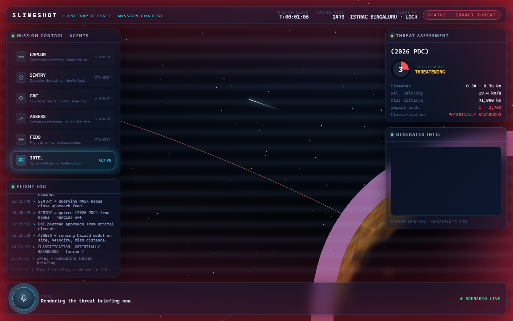
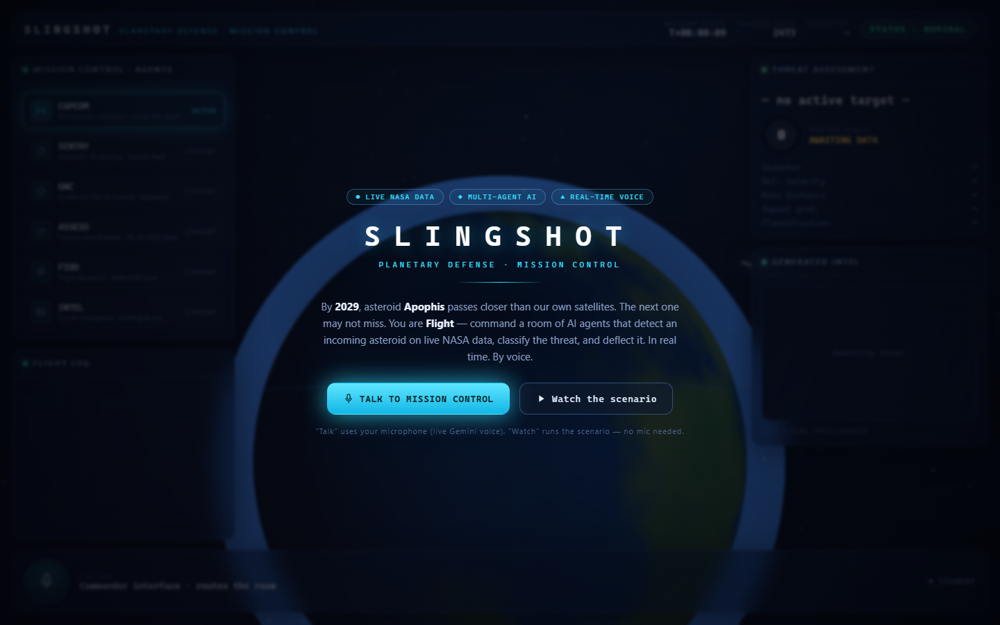

# SLINGSHOT — Planetary Defense Mission Control

**A real-time, voice-driven, multi-agent NASA app.** You are "Flight." You talk live to **CAPCOM**, and a room of AI agents — CAPCOM → SENTRY, GNC, ASSESS, INTEL, FIDO — detects an incoming near-Earth asteroid, classifies its hazard with an ML model on **real NASA NEO data**, generates visual intel, and executes a **DART-style kinetic-impactor deflection** — all rendered in a cinematic Three.js/GSAP orbital scene driven by the agents' own tool calls.

Built for the hackathon. `#BuildWithGemini` · [@googleaidevs](https://twitter.com/googleaidevs)

<p>
  <a href="https://api.nasa.gov"></a>
  <a href="https://www.kaggle.com/datasets/sameepvani/nasa-nearest-earth-objects"></a>
  <a href="https://www.nasa.gov/dart"></a>
  
  <a href="https://vimeo.com/1209037347"></a>
</p>

### ▶ [Watch the 1-minute demo](https://vimeo.com/1209037347) &nbsp;·&nbsp; 🚀 [Live app](https://slingshot-mfv34xhhrq-uc.a.run.app)

[](https://vimeo.com/1209037347)
<p align="center"><i>The live console mid-scenario — click the image to watch the demo. Landing screen below.</i></p>



---

## 🛰️ Real NASA data — not a mock

<a href="https://api.nasa.gov"></a>

SLINGSHOT runs on **actual near-Earth-object data from NASA** — not synthetic or placeholder values. Every figure on screen traces to a source in [`RESEARCH.md`](RESEARCH.md).

- **Live** — NASA's **[NeoWs](https://api.nasa.gov)** API streams real close-approach asteroids on demand; in testing the app pulled a genuine NEO for the current date and classified it live.
- **Model / offline** — trained on the **[NASA Nearest Earth Objects](https://www.kaggle.com/datasets/sameepvani/nasa-nearest-earth-objects)** dataset: **90,836 real NEOs**, sourced from NASA JPL / NeoWs (public domain).
- **Grounded science** — "hazardous" uses NASA's *actual* PHA definition (absolute magnitude H ≤ 22 ≈ ≥140 m **and** miss distance ≤ 0.05 AU / 7.48 M km, per [CNEOS](https://cneos.jpl.nasa.gov/about/neo_groups.html)); risk shown on the real **Torino scale (0–10)**; the deflection models **[NASA DART](https://www.nasa.gov/dart)**, which really shortened Dimorphos's orbit by **~32 minutes** ([*Nature* 2023](https://www.nature.com/articles/s41586-023-05805-2)).

> No dummy data. The bundled `neo_snapshot.json` is 12 **real** catalogued objects (Apophis, Bennu, Apollo, …) used only as an offline fallback when the venue has no network.

---

## Why now (2026)

Rapid, coordinated near-Earth-object threat response is **not a solved problem** — the global protocol went live for the *first time* in 2025, and the field is racing to catch up:

- **2024 YR4** hit a record **3.1%** Earth-impact probability (Feb 2025, Torino 3) and was the **first asteroid ever** to trigger the UN-endorsed IAWN warning + SMPAG mission-planning chain. Its odds swung from rising alarm to all-clear within weeks — proving the value is in **fast, iterative assessment**, which is exactly what SLINGSHOT models.
- **Apophis · 13 Apr 2029:** a ~340 m asteroid passes **within ~32,000 km — inside the ring of geostationary satellites.** The science campaign (Earth-gravity modeling, observation planning, NASA's **OSIRIS-APEX** rendezvous) is being prepared **right now, in 2026.**
- **ESA Hera arrives Nov 2026** to finally measure the momentum transfer of **DART (2022) — humanity's only asteroid deflection, ever.**
- **NEO Surveyor**, the first telescope purpose-built to find two-thirds of city-killer NEOs, **doesn't launch until 2027** — most are still undetected.

One deflection ever attempted, an incomplete catalog, and warning times from years to days: SLINGSHOT is a working answer to a problem the world is *actively* wrestling with in 2026. (Sources in [`RESEARCH.md`](RESEARCH.md).)

---

## Impact in India 🇮🇳

India is now a top-tier spacefaring nation — Chandrayaan-3, Aditya-L1, Gaganyaan — and is building serious **space situational awareness (SSA)**: ISRO's **NETRA** (Network for Space Objects Tracking and Analysis), the **ISTRAC** ground-station network in Bengaluru, and a fast-growing private SSA sector (IN-SPACe; startups like Digantara). Tracking near-Earth objects and orbital threats is a live national priority — SLINGSHOT is the **AI mission-control + decision-support layer** that sits on top of it:

- **ISRO / IN-SPACe / SSA startups** — a low-cost, real-time, multi-agent ops console: voice-driven threat assessment and coordinated response over live tracking data. The orchestration + tool pattern generalizes to satellite ops, collision-avoidance, and launch operations. Swap the NASA feed for **ISRO/NETRA** data and the same engine becomes a real Indian SSA tool.
- **Education & public engagement** — after Chandrayaan-3, space captivates India. A voice-driven, cinematic planetary-defense experience makes advanced space-ops + AI orchestration tangible for planetariums, schools, and IIT/IISc labs.
- **Global South leadership** — an accessible, affordable template for planetary-defense decision support, with India leading a domain today dominated by NASA/ESA.

*(The live telemetry already locks onto **ISTRAC Bengaluru** and **NETRA** — the demo is India-aware by design.)*

---

## The four qualifying technologies

| Technology | Model | Role |
|---|---|---|
| **Gemini Live API** | `gemini-3.1-flash-live-preview` | Real-time voice + vision, barge-in — you talk to CAPCOM |
| **iAPI / Managed Agents** | ADK multi-agent + tool layer | The 6-agent mission-control room (the centerpiece) |
| **Nano Banana 2 Lite** | `gemini-3.1-flash-lite-image` | Live threat-briefing cards |
| **Omni Flash** | `gemini-omni-flash-preview` | Impact / deflection simulation video |

See `Design.md` for the full architecture, diagrams, and data/ML details.

---

## 🧪 Testing the multi-agent system (for judges)

You can inspect and test each agent **individually**, and watch the collaboration end-to-end:

**Inspect each agent individually with the ADK web UI** — it shows the agent tree and lets you message any agent directly:
```bash
cd app && ADK_WEB=1 ../.venv/Scripts/python.exe -m google.adk.cli web
# open the printed URL, pick an agent (CAPCOM / SENTRY / GNC / ASSESS / INTEL / FIDO),
# and message it to exercise that agent + its tool. In this mode CAPCOM delegates via
# transfer_to_agent, so you see genuine per-agent tool calls and handoffs.
```

**Full console** (voice + 3D): `cd app && uvicorn main:app` → open http://localhost:8000 (`?live=1` for the live voice session; no flag = the self-running scenario).


*The live console mid-scenario: agents on the left, the 3D asteroid + trajectory, the Torino-7 threat panel, and a **real Nano-Banana-2-generated** threat-briefing card in "Generated Intel".*

---

## Quickstart

```bash
# 1. Environment
python -m venv .venv
# Windows: .venv\Scripts\activate    |    macOS/Linux: source .venv/bin/activate
pip install -r requirements.txt

# 2. Configure the API key (never hardcoded)
cp app/.env.template app/.env
#   then edit app/.env and set:  GOOGLE_API_KEY=your-key

# 3. Run
cd app
uvicorn main:app
#   open http://localhost:8000
```

### Two modes

- **Mock mode (default):** the console runs the full planetary-defense scenario with **no backend** — just tap the mic. Every number is grounded in the real research (NeoWs-style features, Torino scale, DART's ~32-min deflection). This is the reliability net for one-shot judging.
- **Live mode:** append **`?live=1`** → `http://localhost:8000/?live=1`. Tapping the mic opens the WebSocket to the ADK backend, streams your mic audio + camera frames up, and the live agents drive the same visuals via their tool calls.

### Optional: generated media

Media generation (NB2 Lite cards, Omni Flash video) is off by default. Enable it with:

```bash
SLINGSHOT_MEDIA=1 uvicorn main:app
```

Without it, INTEL renders bundled fallback cards — the demo still runs end to end.

### NASA key note

Live NEO data uses NASA's NeoWs API. Get a free key at **[api.nasa.gov](https://api.nasa.gov)** (1,000 req/hr) — or the built-in **`DEMO_KEY`** works for light use (30 req/hr, 50/day). The key is used **server-side only** and is never shipped to the browser.

---

## Repo & license

- **Repo:** https://github.com/preethamtjit20-spec
- **License:** MIT — see [`LICENSE`](LICENSE).

## Data & credits

Grounded in real NASA data and published research — see [`RESEARCH.md`](RESEARCH.md). All NASA data and imagery are public domain. Built with Google ADK + the Gemini API, Three.js, and GSAP.
